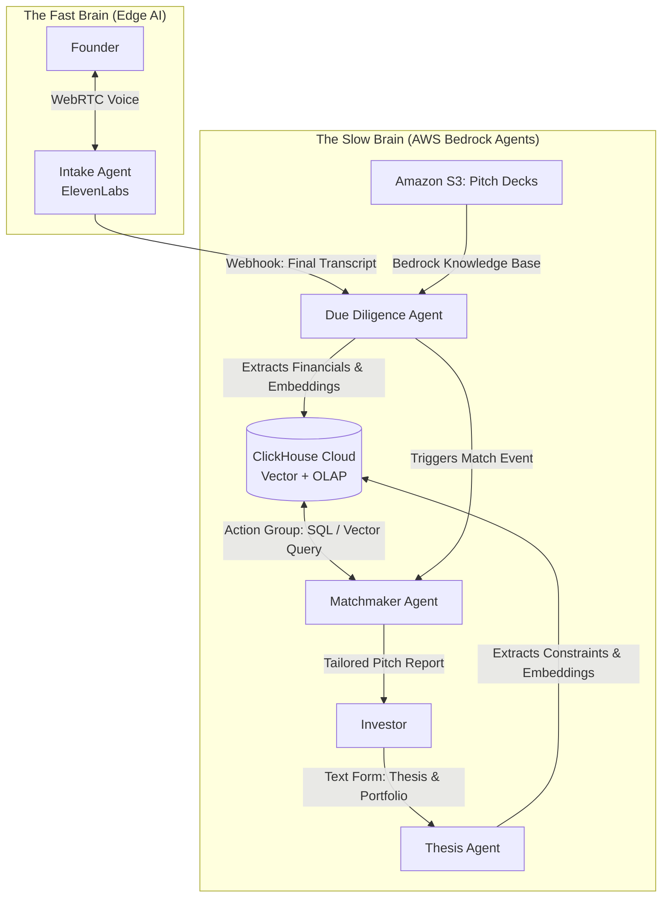
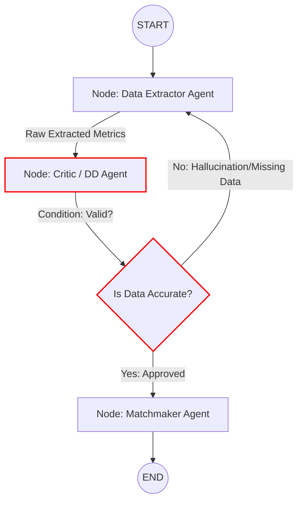

# MatchMyPitch

**The "Tinder for Founders and Funders" — built on Agentic AI.**

MatchMyPitch replaces static application forms with an interactive, dynamic matchmaking engine. Startups pitch their ideas live to an AI voice agent, while investors submit their core thesis and financial constraints. Our backend "Slow Brain" then cross-references the live pitch transcript with uploaded pitch decks, validates the claims, and generates tailored matchmaking reports for compatible investors.

---

## 🧠 System Architecture

MatchMyPitch splits the cognitive load into two distinct engines to solve the latency problem: 
* **The "Fast Brain" (Edge AI):** Powered by ElevenLabs WebRTC for ultra-low latency (<500ms) live voice interviews.
* **The "Slow Brain" (Cognitive Engine):** Powered by AWS Bedrock Agents (or Strands SDK) to handle complex document parsing, state management, and database embeddings without blocking the user interface.



---

## 🛡️ The Agentic Engine: "Correction over Regeneration"

Traditional LLM workflows often hallucinate when parsing complex financial data. MatchMyPitch relies on a rigorous **Planner-Executor-Critic** model with a built-in self-healing loop.

Instead of generating a final match immediately, the **Critic/DD Agent** cross-references the metrics extracted from the S3 pitch deck against the verbal claims made during the ElevenLabs live interview. If there is a discrepancy (e.g., the deck claims $50k MRR, but the transcript says $30k), the graph routes back for refinement before saving to the database.



---

## 🛠️ Tech Stack

* **Frontend:** Next.js (TypeScript), Tailwind CSS.
* **Voice SDK:** `@elevenlabs/react` (Real-time WebRTC Conversational AI).
* **AI Orchestration:** AWS Bedrock Agents / `strands-agents` Python SDK.
* **Database:** ClickHouse Cloud (Handles both structured OLAP querying and `Float32` HNSW Vector Search).
* **Storage:** Amazon S3 (Pitch decks and portfolios) mapped to Bedrock Knowledge Bases.
* **API:** FastAPI (Webhook ingestion).

---

## ⚡ Quick Start

### 1. Prerequisites

* Node.js v18+
* Python 3.11+
* ClickHouse Cloud Account
* ElevenLabs API Key

### 2. Environment Setup

Clone the repository and install dependencies for both the frontend and backend:

```bash
git clone [https://github.com/yourusername/MatchMyPitch.git](https://github.com/yourusername/MatchMyPitch.git)
cd MatchMyPitch

# Install Frontend
cd web
npm install

# Install Backend
cd ../api
python -m venv venv
source venv/bin/activate
pip install -r requirements.txt

```

### 3. Database Initialization

Ensure your ClickHouse table is configured to handle the hybrid vector matching:

```sql
CREATE TABLE platform_matchmaking (
    id String,
    user_type Enum8('startup' = 1, 'investor' = 2),
    max_valuation UInt64,
    semantic_thesis_vector Array(Float32),
    INDEX vector_index semantic_thesis_vector TYPE vector_similarity('hnsw', 'cosineDistance', 384)
) ENGINE = MergeTree ORDER BY id;

```

### 4. Run the Platform

Start both servers locally:

```bash
# Terminal 1 (Backend Webhook Receiver)
fastapi dev main.py

# Terminal 2 (Next.js App)
npm run dev

```

---

## 🤝 Contributing

MatchMyPitch is built using **Spec-Driven Development** via Kiro IDE to maintain strict agentic logic. Please ensure all modifications to the Python `agents/` directory include the proper `@tool` decorators for database operations. See `CONTRIBUTING.md` for more details.

## 📄 License

This project is licensed under the MIT License - see the [LICENSE](https://www.google.com/search?q=LICENSE) file for details.
